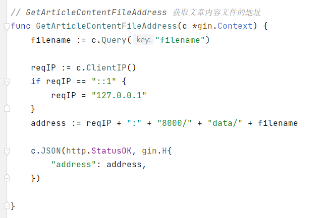

#CampingInfo 

## Environment

|                     name                      | version |
| :-------------------------------------------: | :-----: |
|                      go                       |  1.17   |
|                      gin                      |  1.7.7  |
|                 gorm.io/gorm                  | v1.22.5 |
|             gorm.io/driver/mysql              | v1.2.3  |
|                     MySQL                     | 8.0.25  |
|   [go-ini/ini](https://ini.unknwon.io/docs)   | 1.66.2  |
| [unknwon/com](https://github.com/unknwon/com) |  1.0.1  |

## West2AroundTwo

[Anxiu/CampingNow (gitee.com)](https://gitee.com/anxiu_yc/camping-now)

### Task 2

Task 2 is in the path routers/router.go test group


Support test URL, 
```url
http://127.0.0.1:8000/test
```

### Task 3
Task 3 is also in the path routers/router.go test group


Support test URL, 
```url
http://127.0.0.1:8000/test
```

### Task 4

Task 4 is in the api group, also in the path routers/router.go. I defined a struct named article, 


it extend the struct model, 


Both of them are in the path models/, after that the api of Article is in the path routers/api/article.go, the function `GetArticle(c *gorm.Context)` is one api in the `.go` file 


All of the article api I registered them in the routers/router.go file.


Support test URL, 
```url
http://127.0.0.1:8000/api/articles
```

### Task 5

The main body of task 5 is in the `UploadFileAsArticleContext(c *gorm.Context)` function, I upload the file into data/ path. Also it has been registered in the router.


Support test URL, 
```url
http://127.0.0.1:8000/api/articles/upload
```

### Task 6

In fact, I have no idea in this question, I do think the file address should be store in the database, article table, content attribute. But I'm still studying the gorm v2 and do my best to work in this way. 

Support test URL, 
```url
http://127.0.0.1:8000/api/articles/address?filename=textFile.txt
```

## Structure

- ==[[conf]]==: 用于存储配置文件
  
- ==data==

- ==log==
  
- ==models==: 应用数据库模型
  
- ==[[pkg]]==: 第三方包
  
- ==routers==: 路由逻辑处理
  
- ==static==: 

- ==templates==: 模板文件, `.gohtml`

[[go 项目一般项目结构]] 